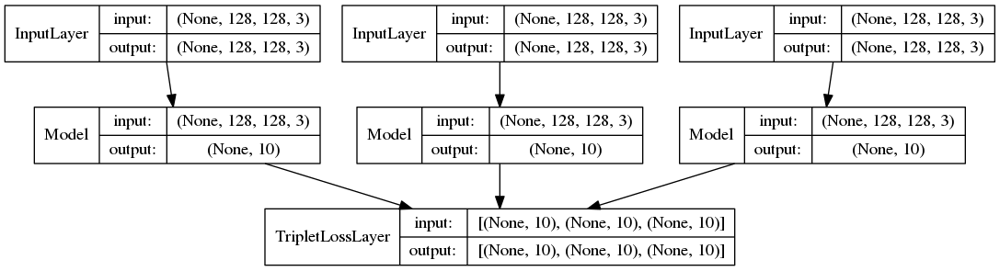
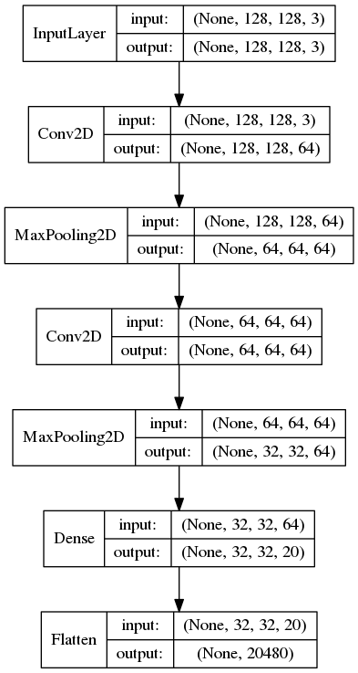

## Cross-domain image retrieval on fashion with designed triplet loss
### Current Structure of Network

#### Partial Network 'embNet'
 
## Implementation
These notebooks are implemented by keras = 3.5 or 3.6.

## Usage
Before execute jupyter notebook, we need some work. 
```
$ mkdir model
$ brew install graphviz
# or apt-get install graphviz
$ pip install pydot
```
## dataset
By using the Dataset of DeepFashion, I address one of the three tasks.
 (http://mmlab.ie.cuhk.edu.hk/projects/DeepFashion.html)
Calculate accuracy by top-K score of retrievals.   

First, I'll try to use the FashionNet which is suggested by the provider of the Dataset.
（https://ieeexplore.ieee.org/document/7780493/）
> **2.3. Benchmarks**<br>
We build the following benchmarks out of DeepFashion for evaluating different methods.
> **Category and Attribute Prediction**<br>
This task is to classify 50 fine-grained categories and 1, 000 attributes. There are 63, 720 diverse images in this benchmark. For category classification, we employ the standard top-k classification accuracy as evaluation metric. For attribute prediction, our measuring criteria is the top-k recall rate following [9], which is obtained by ranking the 1, 000 classification scores and determine how many attributes have been matched in the top-k list.
> **In-Shop Clothes Retrieval**<br>
This task is to determine if two images taken in shop belong to the same clothing item 5. It is important when customers encounter shop image on photo sharing sites and would like to know more about its item information on online retailer stores. This benchmark contains 54,642 images of 11,735 clothing items from Forever21. Top-k retrieval accuracy is adopted to measure the performance of fashion retrieval, such that a successful retrieval is counted if the exact fashion item has been found in the top-k retrieved results.
> **Consumer-to-Shop Clothes Retrieval**<br>
This scenario has been considered by several previous works [10], [12], aiming at matching consumer-taken photos with their shop counterparts. We select 251,361 consumer-to-shop image pairs from Mogujie for this benchmark. Again, top-k retrieval accuracy is employed to evaluate performance.


